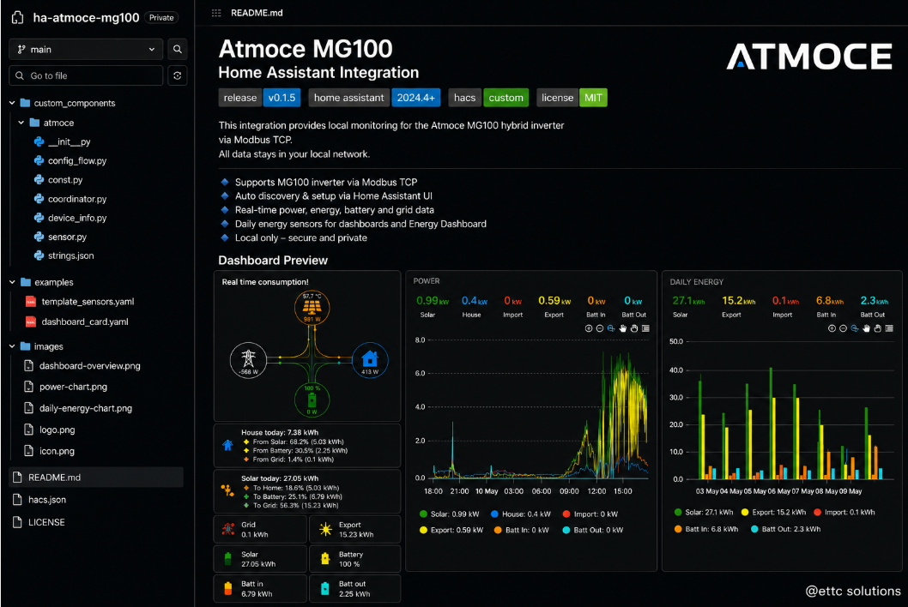

# Atmoce MG100



Custom Home Assistant integration for the **Atmoce MG100** gateway using local Modbus TCP.

> This is an independent community project.  
> It is not affiliated with, endorsed by, or supported by Atmoce.


## What it does

This integration creates Home Assistant sensors for the Atmoce MG100 system using local Modbus TCP.

It provides sensors for:

- PV power and daily energy
- Battery SOC
- Battery charge/discharge power
- Battery charge/discharge daily energy
- Grid import/export power
- Grid import/export daily energy
- Grid voltage and current
- Additional MG100 status and energy registers

All communication is local. No cloud connection is required.

## Status

Current release:

```text
v0.1.5
```

This is a private/testing release. The integration is read-only and does not expose battery control or write registers.

## Installation

### HACS custom repository

1. Open **HACS**
2. Go to **Integrations**
3. Open the menu and choose **Custom repositories**
4. Add:

```text
https://github.com/cristtiann/ha-atmoce-mg100
```

5. Category:

```text
Integration
```

6. Install **Atmoce MG100**
7. Restart Home Assistant

### Manual installation

Copy:

```text
custom_components/atmoce
```

to:

```text
/config/custom_components/atmoce
```

Then restart Home Assistant.

## Configuration

After restart:

1. Go to **Settings → Devices & services**
2. Click **Add integration**
3. Search for **Atmoce MG100**
4. Enter your local gateway settings:
   - Host/IP address
   - Port, default `502`
   - Slave/device address, default `1`
   - Scan interval

## Entity naming

The integration targets clean entity IDs such as:

```text
sensor.atmoce_pv_power
sensor.atmoce_battery_power
sensor.atmoce_grid_power
sensor.atmoce_battery_soc
sensor.atmoce_grid_import_energy_daily
sensor.atmoce_grid_export_energy_daily
sensor.atmoce_battery_charge_energy_daily
sensor.atmoce_battery_discharge_energy_daily
```

If Home Assistant creates entities with `_2` or old names, remove old unavailable/stale entities from the entity registry and add the integration again.

## Optional examples

The integration itself does not require YAML.

Optional examples are included for users who want additional dashboard calculations:

```text
examples/template_sensors.yaml
examples/dashboard_card.yaml
```

Required custom cards for the dashboard example:

- `tesla-style-solar-power-card`
- `mushroom`
- `apexcharts-card`
- `card-mod`

## Screenshots


## Safety

This integration is read-only.

It does not write Modbus registers and does not control the battery, inverter, charge/discharge behaviour, or grid export settings.

## Credits

Created by:

```text
@ettc solutions
```

## License

MIT
